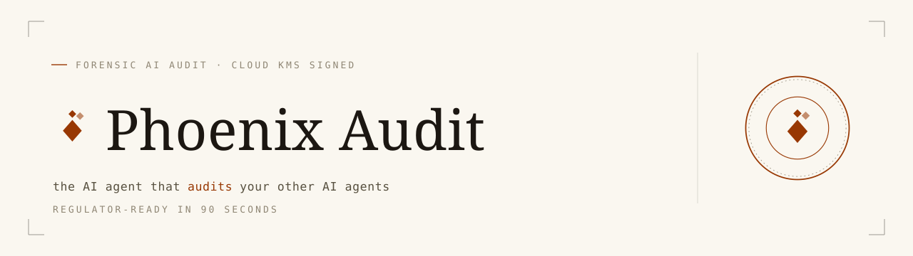

<!-- BANNER (Surface BR · designer-delivered) -->
<!-- TODO: <p align="center"><picture><source media="(prefers-color-scheme: dark)" srcset="apps/phoenix-audit-web/public/brand/banner-dark.svg"></picture></p> -->

# Phoenix Audit

**The AI agent that audits your other AI agents — regulator-ready signed report in 90 seconds.**

Point Phoenix Audit at any production AI agent (customer-support bot, prior-authorization agent, internal copilot) and it runs an adversarial test battery, watches the agent's internal execution via Arize Phoenix, collapses independent failures into one root cause, and emits a cryptographically signed audit report — keyed to a commit SHA, ready to hand to a compliance officer.

What a Big-4 audit pack costs €80K–€250K and takes 12–18 months for, Phoenix Audit ships in 98 seconds. Same Phoenix telemetry. Same evidence chain. Different artifact.

→ **[Live demo](https://phxaudit.xyz/replay)** · **[Run an audit](https://phxaudit.xyz/new)** · **[Documentation](./docs/)**

---

## Architecture

<!-- ARCHITECTURE (Surface AR · designer-delivered SVG) -->
<!-- TODO: <p align="center"></p> -->

Three Cloud Run services in concert:

- `phoenix-audit-web` (Next.js 16) — the operator surface: authenticate, point at a target, watch the live audit chamber, download the signed report.
- `phoenix-audit-agent` (Google ADK orchestrator) — runs Injector → Judge → Patcher sub-agents in a sequential pipeline; the Injector fires the adversarial battery via A2A, the Judge fetches Phoenix spans and clusters failures by root cause, the Patcher drafts the hardening recipe.
- `target-agent` (the sacrificial demo) — a deliberately naive customer-support agent. The audit can also point at any ADK / LangChain / CrewAI / OpenAI-Agents-SDK / generic-HTTP target.

The orchestrator joins the trace context onto every probe so the Judge can read the target's own internal execution from Phoenix. The final report is signed against the operator's Cloud KMS key, stored in GCS with a 7-day signed URL, and (optionally) filed as a hardening-recipe merge request against the target's repository.

Full detail in [`docs/architecture.md`](./docs/architecture.md) — 12 ADRs covering target adapter tiers, Phoenix Cloud + ADK wiring, the hybrid hosting model, the cryptographic signing chain, and the GitLab MR shape.

---

## Built on

<!-- TOOL ECOSYSTEM (Surface TE · designer-delivered) -->
<!-- TODO: <p align="center"></p> -->

- **Google Cloud** — Cloud Run (3 services), Cloud KMS (Ed25519 signing), Cloud Firestore (run + dataset index), Cloud Storage (signed reports), Secret Manager (Phoenix + Resend + GitLab OAuth), Artifact Registry (build-once-promote-everywhere), Workload Identity Federation (CI auth), Cloud Build.
- **Arize Phoenix** — span telemetry + OpenInference instrumentation; Phoenix is where the evidence chain lives.
- **Vertex AI + Gemini** — `gemini-3.5-flash` as the judge LLM; Vertex AI is the inference plane for the target's own model calls.
- **Google ADK + A2A** — agent orchestration and the cross-agent wire protocol.
- **Web stack** — Next.js 16, Tailwind 4, Firebase Authentication, shadcn/ui, visx, Framer Motion.
- **Backend stack** — Python 3.12, `uv`, `pytest`, `ty`.
- **Integrations** — GitLab (OAuth + MR filing per ADR-011), Resend (transactional email), WeasyPrint (PDF signing pipeline).

---

## Quickstart

```bash
# 1. Install Python + TS deps
uv sync
pnpm install

# 2. Set up secrets (one-time)
cp .env.example .env
# populate PHOENIX_API_KEY, GEMINI_API_KEY, FIREBASE_*, GITLAB_OAUTH_*, RESEND_API_KEY

# 3. Start each app in its own terminal
pnpm --filter phoenix-audit-web dev          # http://localhost:3000
uv run --package phoenix-audit-agent uvicorn phoenix_audit_agent.main:app --port 8080
uv run --package target-agent target-agent   # http://localhost:8001
```

Then open `http://localhost:3000` and follow the onboarding wizard.

For Cloud Run deployment instructions see [`docs/cicd.md`](./docs/cicd.md).

---

## Documentation

| Document                                                           | What it covers                                                          |
| ------------------------------------------------------------------ | ----------------------------------------------------------------------- |
| [`docs/PRD.md`](./docs/PRD.md)                                     | Product vision · day-1 user · competitive position                      |
| [`docs/architecture.md`](./docs/architecture.md)                   | System architecture · 12 ADRs · evidence chain                          |
| [`docs/demo-strategy.md`](./docs/demo-strategy.md)                 | The "three failures · one root cause · patch in four seconds" demo flow |
| [`docs/data-retention-policy.md`](./docs/data-retention-policy.md) | GDPR Article 28 · 24h trace retention · cryptographic erasure           |
| [`docs/cicd.md`](./docs/cicd.md)                                   | CI/CD pipeline · Cloud Run deploy · Workload Identity Federation        |
| [`docs/run-config-schema.md`](./docs/run-config-schema.md)         | JSON Schema for audit run configuration                                 |
| [`docs/assets.md`](./docs/assets.md)                               | Designer briefs (banner · architecture SVG · tool ecosystem image)      |

---

## License

[Apache License 2.0](./LICENSE).

Attributions: see [`NOTICE`](./NOTICE). Architectural inspiration from `deepankarm/agent-chaos` (Apache-2.0) — no code copied.
